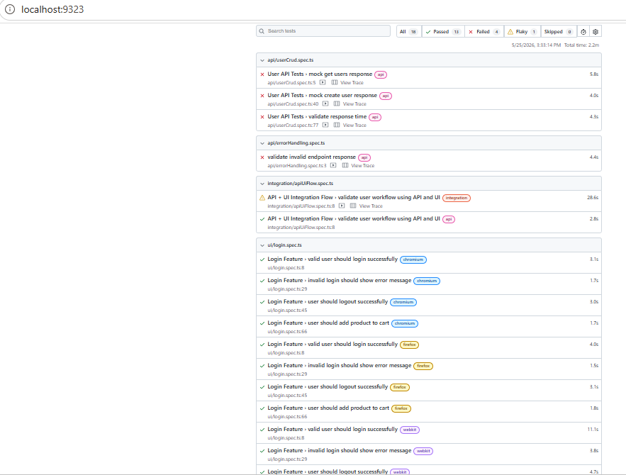
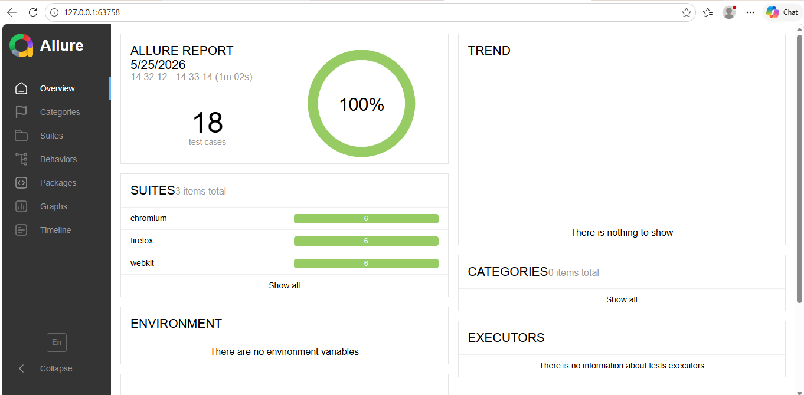
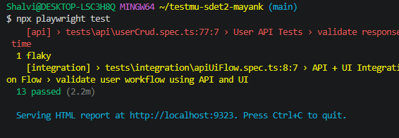

# Playwright Automation Framework

## Overview

This project is an enterprise-grade automation framework built using:

- Playwright
- TypeScript
- Page Object Model (POM)
- Allure Reporting
- GitHub Actions CI/CD

The framework validates:
- UI workflows
- API workflows
- API + UI integration flows
- Cross-browser compatibility

---

# Framework Architecture

## Tech Stack

| Technology | Purpose |
|---|---|
| Playwright | UI & API Automation |
| TypeScript | Type Safety |
| Allure | Reporting |
| GitHub Actions | CI/CD |
| POM | Maintainable UI Structure |

---

# Folder Structure

# Folder Structure

```bash
.
├── api/
│   └── clients/
├── config/
├── docs/
│   └── screenshots/
├── fixtures/
├── pages/
│   ├── BasePage.ts
│   ├── DashboardPage.ts
│   └── LoginPage.ts
├── tests/
│   ├── api/
│   │   ├── errorHandling.spec.ts
│   │   └── userCrud.spec.ts
│   ├── integration/
│   │   └── apiUiFlow.spec.ts
│   └── ui/
│       └── login.spec.ts
├── utils/
├── .github/
│   └── workflows/
│       └── playwright.yml
├── playwright.config.ts
├── package.json
├── tsconfig.json
├── README.md
├── test-strategy.md
└── ai-usage-log.md
```

---

# Features Implemented

## UI Automation
- Login validation
- Invalid login handling
- Logout workflow
- Add-to-cart validation

## API Automation
- GET validation
- POST validation
- Error handling
- Response time assertions
- Mocked API responses

## Integration Flow
- API + UI orchestration
- Dashboard validation
- End-to-end workflow validation

## Reporting
- Playwright HTML Reports
- Allure Reports
- Screenshot capture
- Video recording
- Trace generation

## Cross Browser Coverage
- Chromium
- Firefox
- WebKit

---

# Installation

## Clone Repository

```bash
git clone <repo-url>
cd testmu-sdet2-mayank
```

## Install Dependencies

```bash
npm install
```

## Install Browsers

```bash
npx playwright install
```

---

# Execute Tests

## Run All Tests

```bash
npx playwright test
```

## Run UI Tests

```bash
npx playwright test tests/ui
```

## Run API Tests

```bash
npx playwright test tests/api --project=api
```

## Run Integration Tests

```bash
npx playwright test tests/integration --project=integration
```

---

# Reporting

## Open Playwright Report

```bash
npx playwright show-report
```

## Generate Allure Report

```bash
npx allure-commandline generate allure-results --clean -o allure-report
```

## Open Allure Report

```bash
npx allure-commandline open allure-report
```

---

# CI/CD

GitHub Actions workflow automatically:
- installs dependencies
- executes tests
- generates reports

on every push to main branch.

---

# Design Decisions

## Why POM?
Improves:
- maintainability
- reusability
- readability

## Why API Mocking?
Public APIs became unstable/rate-limited during execution.
Mocking ensured:
- deterministic execution
- CI-safe automation
- reliable reporting

## Why Separate API Project?
API tests are browser-independent.
Separating them:
- improves execution speed
- avoids redundant browser runs
- reduces flaky behavior

---

# Challenges Faced

- Public API instability
- Allure + Java setup
- Browser/API execution segregation
- Retry stabilization

---
# Execution Evidence

## Playwright Report


## Allure Report


## Test Execution


# Author

Mayank Yadav